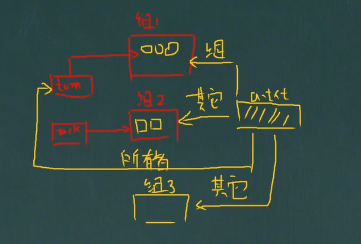

[toc]

# 组

> 在 Linux 中，每个用户必须属于一个组，不能独立于组之外。
>
> 在 Linux 中，每个文件都有*所有者、所在组、其他组*的概念。

## 所有者

> 一般为文件的创建者。谁创建了该文件，谁就是该文件的所有者。

### 查看文件的所有者

~~~
ls -ahl
~~~

### 修改文件的所有者

~~~
chown 用户名 文件名
~~~

## 所在组

> 当某个用户创建了一个文件后，这个文件的所在组即该用户所在的组。

### 组的创建

~~~
groupadd 组名
~~~

### 查看文件 / 目录所在组

~~~
ls -ahl
~~~

### 修改文件所在的组

~~~
chgrp 组名 文件名
~~~

## 其他组

> 除文件的所有者和所在组的用户外，系统的其他用户都是文件的其他组。

## 改变用户所在组

> 在添加用户时，可以指定将该用户添加到哪个组中。
>
> 同样的，可以用 root 的管理权限，可以改变某个用户的所在组。

### 改变用户所在组

~~~
usermod -g 新组名 用户名
usermod -d 目录名 用户名(改变用户登录的初始目录)
~~~

