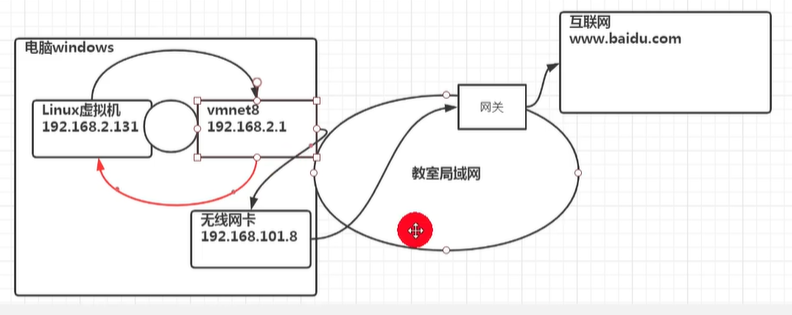
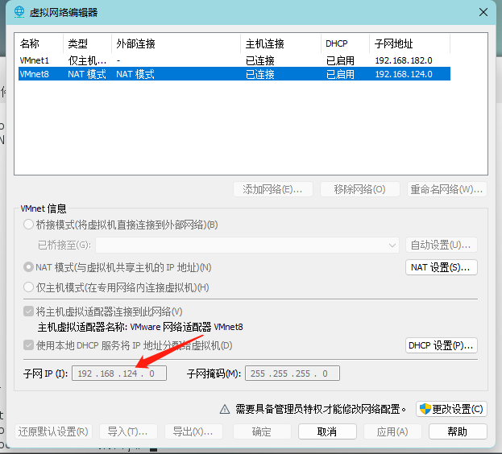
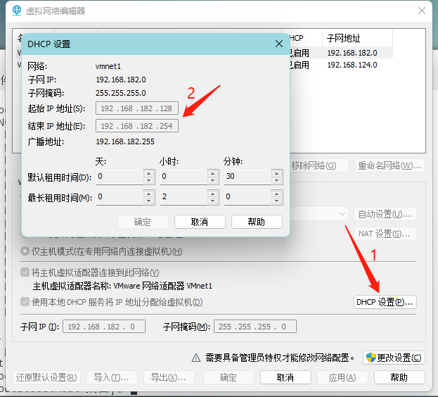
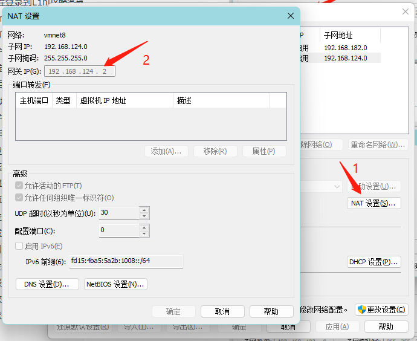
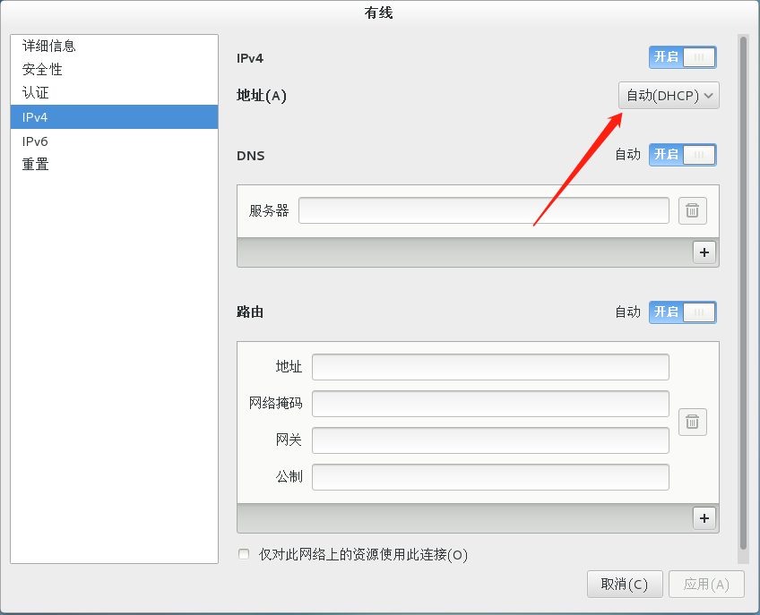
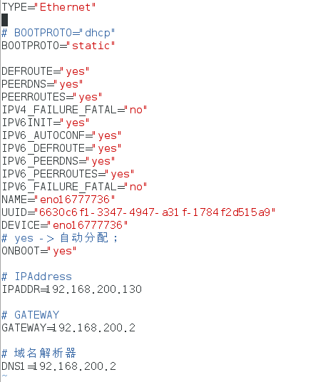
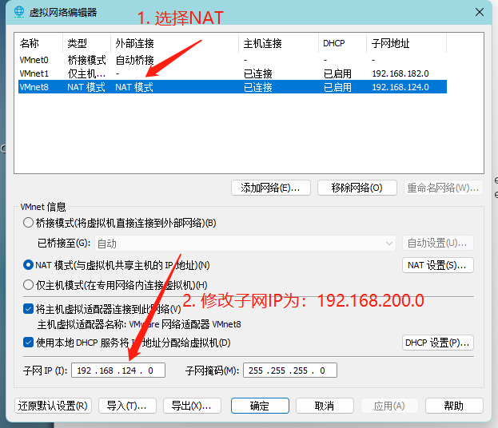
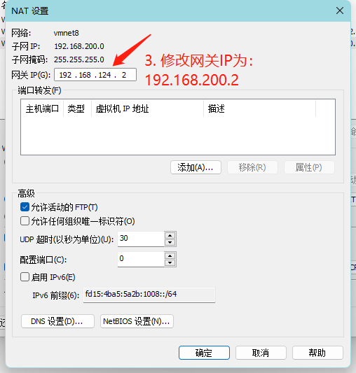
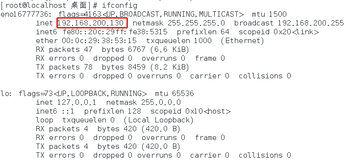
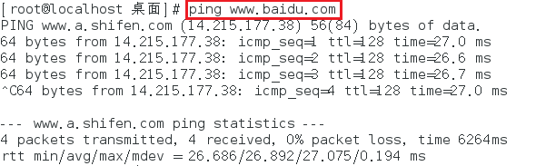

[TOC]

# 网络配置

## NAT网络配置

### 原理图



IP地址要在同一网段才能进行通信。

## 网络配置指令

### 查看网络IP和网关

#### 查看虚拟网络编辑器和修改IP地址

为什么我们的 Linux虚拟机的 IP地址是：192.168.124.146 呢？如下中*子网IP*：



在这里，可以查看我们 Linux虚拟机 IP地址分配的范围：



#### 查看网关



#### 查看网络配置

```
// windows 环境中查看网络配置
ipconfig
// 也可 控制面板 -> 网络和Internet -> 网络连接，中查看vmnet8网络，此时显示为自动获取IP地址。

// linux 中网络配置
ifconfig
```

### ping：测试主机之间网络的连通性

```
ping 目的主机(www.baidu.com)
```

## 网络配置实例

### 方式一：自动获取

> 登陆后，通过界面来设置自动获取IP。
>
> 特点：
> 		Linux 启动后会自动获取IP。
>
> 缺点：
> 		每次获取的IP地址可能不一样。



## 方式二：指定IP

> 直接修改配置文件来指定IP，并且可以连接外网。
>
> 编辑：
>  		vim /etc/sysconfig/network-scripts/ifcfg-xxx
>
> 要求：
>  		将IP地址配置为静态的。
> 		如：192.168.200.130

### 1、配置文件说明



### 2、VMware修改网络配置

保证在同一网段下。





### 3、重启服务

```
service network restart
// 或
reboot
```






## 设置主机名和hosts映射

### 设置主机名

> 1. 为了方便记忆，可以给Linux系统设置主机名，也可以根据需要修改主机名。
> 
> 2. 查看主机名指令：
>        hostname
> 
> 3. 修改文件在 /etc/hostname 指定。
> 
> 4. 修改后，重启生效。

### 设置hosts映射

> 如何通过主机名能够找到(如：ping)某个Linux系统？

#### Windows

> 在 C:\Windows\System32\drivers\etc\hosts 文件指定即可。
> 
> 如：
> 	192.168.200.130 nishi

#### Linux

>   在 /etc/hosts 文件中指定。
>   	如：192.168.200.1 lenovo

## 主机名解析过程

### hosts是什么

> hosts 是一个文本文件，其中记录了 IP 和 hostname(主机名) 的映射关系。

### DNS

> DNS(Domain Name System)：域名系统。
> 
> DNS 是互联网上作为 域名和 IP 地址相互映射的一个分布式数据库。

### 案例

> 用户在浏览器输入了 www.baidu.com
>
> 1. 浏览器会先检查浏览器缓存中，有没有该域名解析 IP 地址。如果有，则先调用这个 IP 完成解析；
>    如果没有，则检查操作系统DNS解析器缓存。如果有，直接返回 IP 完成解析。(这两个缓存，可以理解为本地解析器缓存)
>
> 2. 如果本地解析器缓存中，没有对应的映射，则会检查系统中 hosts 文件中是否有配置对应的域名 IP 映射。如果有，则返回 IP 完成解析。
>
> 3. 如果本地DNS解析器缓存和hosts文件中，均没有对应的 IP，则会到域名服务DNS进行解析域。
>
>     一般来说，当电脑第一次成功访问某一个网站后，在一定时间内，浏览器或者操作系统会缓存它的 IP 地址(DNS解析记录)。
>     	如：在 cmd 中输入
>     		ipconfig /displaydns // DNS域名解析缓存
>     		ipconfig /flushdns  // 清除 DNS 缓存
>

