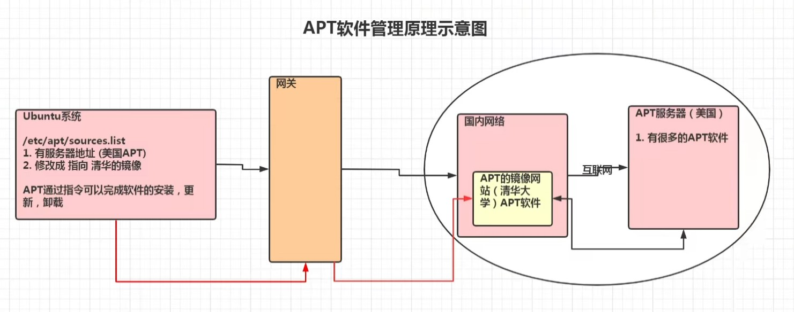

[toc]

# 软件包管理

## rpm

> rpm 用于互联网下载包的打包及安装工具。它包含在某些 Linux 分发版中。
>
> rpm 生成具有 .rpm 扩展名的文件。
>
> rpm 是 RedHat Package Manager(RedHat 软件包管理工具)的缩写，类似于 Windows 的 setup.exe。

### rpm 包名的基本格式

​	一个 rpm 包名：firefox-60.2.2-1.el7.centos.x86_64

​	名称：firefox
​	版本号：60.2.2-1
​	适用操作系统：el7.centos.x86_64
​		表示 centos7.x 的 64 位系统；若是 i686，i386 表示 32 位系统，noarch 表示通用。

### rpm 查询指令

#### 查询已安装的 rpm 列表

~~~
rpm -qa [ | grep xx | more | less ]
// 查看当前是否安装 firefox
~~~

#### 查询软件包是否安装

~~~
rpm -q 包名
// rpm -q firefox
~~~

#### 查询软件包信息

~~~
rpm -qi 包名
// rpm -qi firefox
~~~

#### 查询软件包中的文件

~~~
rpm -ql 包名
// rpm -ql firefox
~~~

#### 查询文件所属的软件包

~~~
rpm -qf 文件全路径名
// rpm -qf /etc/passwd
// prm -qf /root/install.log
~~~

### rpm 安装指令

#### 基本语法

~~~
rpm -ivh rpm 包全路径名
// rpm -hvi dejagnu-1.4.2-10.noarch.rpm 
// 警告：dejagnu-1.4.2-10.noarch.rpm: V3 DSA 签名：NOKEY, key ID db42a60e
// 准备...           
// ########################################### [100%]
~~~

#### 参数说明

| 参数 | 说明          |
| ---- | ------------- |
| -i   | install：安装 |
| -v   | verbose：提示 |
| -h   | hash：进度条  |

#### 案例

> 卸载和安装 firefox。

### rpm 卸载指令

#### 基本语法

~~~
rpm -e rpm包名
// rpm -e firefox
~~~

#### 强制删除

~~~
rpm -e --nodeps foo
~~~

#### 细节讨论

- 如有其他软件包依赖于当前要卸载的软件包，则卸载时会产生错误信息。
- 如果要强制删除某个软件包，可加上 --nodeps。

## yum

> yum（ Yellow dog Updater, Modified） 是一个 Shell 前端软件包管理器。基于 rpm 包管理，能够从指定的服务器自动下载 rpm 包并安装，可以自动处理依赖性关系，并且一次安装所有依赖的软件包。

### yum常用命令

- 列出所有可更新的软件清单命令：**yum check-update**
- 更新所有软件命令：**yum update**
- 仅安装指定的软件命令：**yum install <package_name>**
- 仅更新指定的软件命令：**yum update <package_name>**
- 列出所有可安裝的软件清单命令：**yum list**
- 删除软件包命令：**yum remove <package_name>**
- 查找软件包命令：**yum search <keyword>**
- 清除缓存命令:
    - **yum clean packages**: 清除缓存目录下的软件包
    - **yum clean headers**: 清除缓存目录下的 headers
    - **yum clean oldheaders**: 清除缓存目录下旧的 headers
    - **yum clean, yum clean all (= yum clean packages; yum clean oldheaders)** :清除缓存目录下的软件包及旧的 headers

## apt

> apt（Advanced Packaging Tool），是一款安装包管理工具。
>
> 在 Ubuntu 下，我们可以使用 apt 命令进行软件包的安装、删除、清理等。

### 原理图

### 相关指令

| 指令                                                         | 说明                                       |
| ------------------------------------------------------------ | ------------------------------------------ |
| **sudo apt-get update**                                      | 更新源 / 列出所有可更新的软件清单命令      |
| sudo apt-get upgrade                                         | 更新已安装的软件包                         |
| sudo apt-get dist-upgrade                                    | 更新系统                                   |
| **sudo apt-get install <package_name>**                      | 安装软件包                                 |
| **sudo apt-get install <package_name1> <package_name2> ...** | 同时安装多个软件包                         |
| sudo apt-get install <package_name> -- reinstall             | 重新安装软件包                             |
| sudo apt-get -f install                                      | 修复安装                                   |
| sudo apt-get build-dep <package_name>                        | 安装相关的编译环境                         |
| **sudo apt-get remove <package_name>**                       | 删除软件包                                 |
| sudo apt-get remove <package_name> --purge                   | 删除软件包。包括配置文件等                 |
| sudo apt-cache search <package_name>                         | 搜索软件包                                 |
| **sudo apt-cache show <package_name>**                       | 获取软件包的相关信息。如说明、大小、版本等 |
| sudo apt-cache depends <package_name>                        | 了解使用该包依赖的那些包                   |
| sudo apt-cache rdepends <package_name>                       | 查看该包被哪些包依赖                       |
| **sudo apt-get source <package_name>**                       | 下载该软件包的源代码                       |

- 列出所有可更新的软件清单命令：**sudo apt update**

- 升级软件包：**sudo apt upgrade**

  列出可更新的软件包及版本信息：**apt list --upgradeable**

  升级软件包，升级前先删除需要更新软件包：**sudo apt full-upgrade**

- 安装指定的软件命令：**sudo apt install <package_name>**

  安装多个软件包：**sudo apt install <package_1> <package_2> <package_3>**

- 更新指定的软件命令：**sudo apt update <package_name>**

- 显示软件包具体信息,例如：版本号，安装大小，依赖关系等等：**sudo apt show <package_name>**

- 删除软件包命令：**sudo apt remove <package_name>**

- 清理不再使用的依赖和库文件: **sudo apt autoremove**

- 移除软件包及配置文件: **sudo apt purge <package_name>**

- 查找软件包命令： **sudo apt search <keyword>**

- 列出所有已安装的包：**apt list --installed**

- 列出所有已安装的包的版本信息：**apt list --all-versions**
