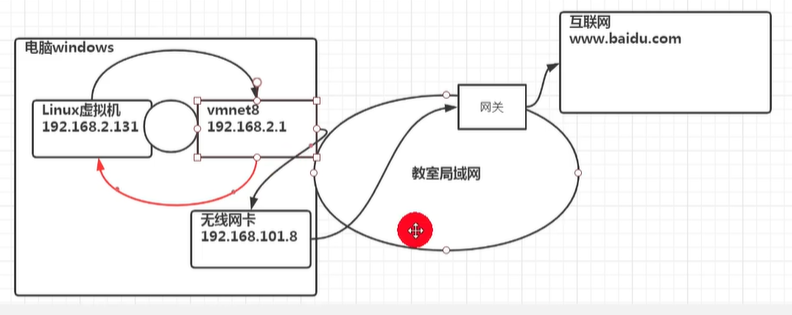
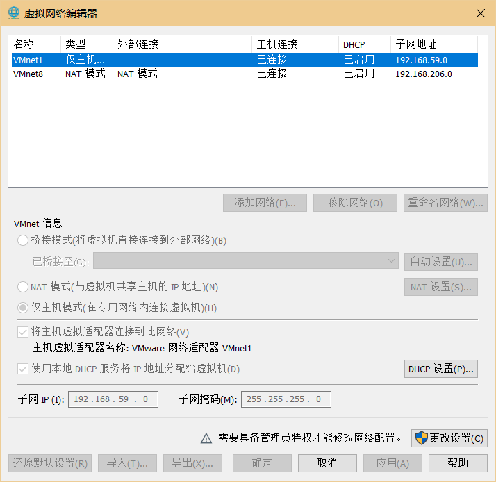
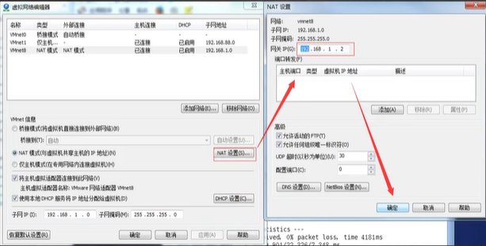
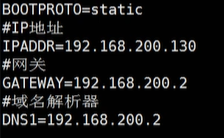

[toc]

# 网络配置

## NAT网络配置

### 原理图

## 网络配置指令

### 查看网络IP和网关

#### 查看虚拟网络编辑器和修改IP地址

#### 查看网关

#### 查看网络配置

~~~
// windows
ipconfig
// linux
ifconfig
~~~

### ping：测试主机之间网络的连通性

~~~
ping 目的主机(www.baidu.com)
~~~

## 网络配置实例

### 方式一：自动获取

> 登陆后，通过界面来设置自动获取IP。
>
> 特点：
> 	Linux 启动后会自动获取IP。
>
> 缺点：
> 	每次获取的IP地址可能不一样。

## 方式二：指定IP

> 直接修改配置文件来指定IP，并且可以连接外网。
>
> 编辑：
> 	vim /etc/sysconfig/network-scripts/ifcfg-xxx
>
> 要求：
> 	将IP地址配置为静态的。如：192.163.2.200

### 配置文件说明

### 重启服务

~~~
service network restart
~~~

## 设置主机名和hosts映射

### 设置主机名

> 1. 为了方便记忆，可以给Linux系统设置主机名，也可以根据需要修改主机名。
>
> 2. 查看主机名指令：
>     	hostname:
>
> 3. 修改文件在 /etc/hostname 指定。
>
> 4. 修改后，重启生效。

### 设置hosts映射

> 如何通过主机名能够找到(如：ping)某个Linux系统？

#### Windows

> 在 C:\Windows\System32\drivers\etc\hosts 文件指定即可。
>
> 如：
> 	192.168.200.130 nishi

#### Linux

> 在 /etc/hosts 文件中指定。
>
> 如：
> 	192.168.200.1 lenovo