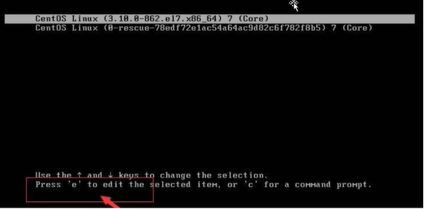
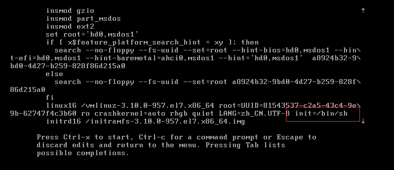
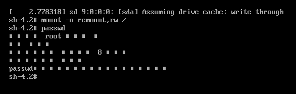

# 找回 root 密码

1. 启动系统，进入开机界面，在界面中按 “e” 进入编辑界面，如：
    
2. 进入编辑界面，使用键盘上的上下键移动光标，找到以 “Linux16” 开头的内容所在的行数，在行的最后面输入：init=/bin/sh。
    
3. 输入完成后，按 ctrl + x 进入单用户模式。
4. 在光标闪烁的位置输入：mount –o remount,rw /
    注意：每个单词间有空格，输入完成后按 enter 键。
5. 在新的一行最后面输入：passwd，完成后按 enter 键。
    输入密码，再次确认密码即可。
    密码修改成功后，会显示 passwd…… 的样式，说明密码修改成功。
    

6. 在鼠标闪烁的位置中(最后一行)，输入：touch /.autorelabel，接着按 enter。
7. 继续在光标闪烁的位置中，输入：exec /sbin/init。接着按 enter。完成后，系统会自动重新启动，密码修改完成。 

