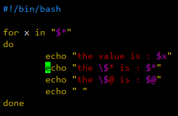

[toc]

# 为什么要学习Shell？

> 1. Linux 运维工程师在进行服务器集群管理时，需要编写 Shell 程序来进行服务器管理。
> 2. 开发人员的工作需要，需要编写一些 Shell 脚本进行程序或者服务器的维护。比如：编写一个定时备份的脚本。
> 3. 大数据程序员需要编写 Shell 程序来管理集群。

# Shell是什么？

> Shell 是一个==命令行解释器==。
>
> 它为用户提供了一个向 Linux 内核发送请求，以便运行程序的*界面系统级程序*。
>
> 用户可以用 Shell 来启动、挂起、停止，甚至是编写一些程序。

# Shell脚本的执行方式

## Shell脚本格式要求

1. 脚本要以：!/bin/bash 开头。
2. 脚本需要有可执行权限(x)。

## 脚本的常用执行方式

方式一：输入脚本的绝对路径或相对路径
	说明：
		首先要赋予 *.sh 脚本 (+x) 权限，再执行脚本。

方式二：sh *.sh
	说明：
		不用赋予 *.sh (+x) 权限，直接执行即可。

## 编写第一个Shell脚本

