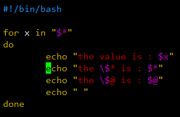

[toc]

# 位置参数变量

## 位置参数变量

### 概述

> 当执行 Shell 脚本时，如果想要获得命令行中的参数信息，可以使用*位置参数变量*。
>
> 如：sh position.sh 1 2 3

### 基本语法

$n：n 为数字，代表第几个参数。$0 代表命令本身。当参数大于 10 时，参数需要使用大括号包含。如：${10}。

$*：代表命令行中所有的参数。$\* 会将所有参数看作一个整体。

$@：代表命令行中所有的参数。$@ 会将所有参数区别看待。

$#：代表命令行中参数的个数。

### 案例

#### $* 与 $@ 的比较

