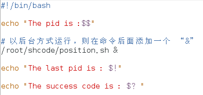
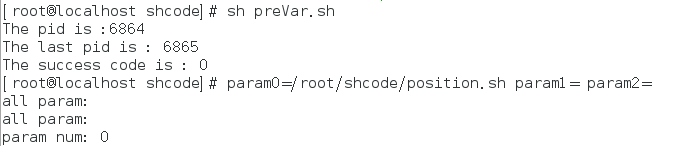

[toc]

## 预定义变量

### 基本介绍

> 预定义变量：指 Shell 设计者预先设计好的变量，可以直接在 Shell 脚本上使用。

### 基本语法

\$\$：
		为当前进程的进程号(pid)

$!：
		后台运行的最后一个进程的进程号(pid)

$?：
		最后一次执行的命令的返回状态。
		如果值为 0，即命令正确执行；如果值为 !0，即命令错误执行。

### 案例-preVar.sh

