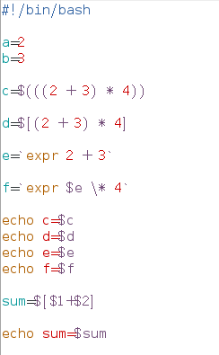

[toc]

# 运算符

## 算术运算符

==a = 10; b = 20==

| 运算符 | 说明                                          | 举例                          |
| :----- | :-------------------------------------------- | :---------------------------- |
| +      | 加法                                          | `expr $a + $b` 结果为 30。    |
| -      | 减法                                          | `expr $a - $b` 结果为 -10。   |
| *      | 乘法                                          | `expr $a \* $b` 结果为  200。 |
| /      | 除法                                          | `expr $b / $a` 结果为 2。     |
| %      | 取余                                          | `expr $b % $a` 结果为 0。     |
| =      | 赋值                                          | a=$b 把变量 b 的值赋给 a。    |
| ==     | 相等。用于比较两个数字，相同则返回 true。     | [ $a == $b ] 返回 false。     |
| !=     | 不相等。用于比较两个数字，不相同则返回 true。 | [ $a != $b ] 返回 true。      |

## 关系运算符

| 运算符 | 说明                                                  | 举例                       |
| :----- | :---------------------------------------------------- | :------------------------- |
| -eq    | 检测两个数是否相等，相等返回 true。                   | [ $a -eq $b ] 返回 false。 |
| -ne    | 检测两个数是否不相等，不相等返回 true。               | [ $a -ne $b ] 返回 true。  |
| -gt    | 检测左边的数是否大于右边的，如果是，则返回 true。     | [ $a -gt $b ] 返回 false。 |
| -lt    | 检测左边的数是否小于右边的，如果是，则返回 true。     | [ $a -lt $b ] 返回 true。  |
| -ge    | 检测左边的数是否大于等于右边的，如果是，则返回 true。 | [ $a -ge $b ] 返回 false。 |
| -le    | 检测左边的数是否小于等于右边的，如果是，则返回 true。 | [ $a -le $b ] 返回 true。  |

## 逻辑运算符

==假定变量 a 为 10，变量 b 为 20==

| 运算符 | 说明       | 举例                                       |
| :----- | :--------- | :----------------------------------------- |
| &&     | 逻辑的 AND | [[ $a -lt 100 && $b -gt 100 ]] 返回 false  |
| \|\|   | 逻辑的 OR  | [[ $a -lt 100 \|\| $b -gt 100 ]] 返回 true |

## 字符串运算符

==假定变量 a 为 "abc"，变量 b 为 "efg"==

| 运算符 | 说明                                         | 举例                     |
| :----- | :------------------------------------------- | :----------------------- |
| =      | 检测两个字符串是否相等，相等返回 true。      | [ $a = $b ] 返回 false。 |
| !=     | 检测两个字符串是否不相等，不相等返回 true。  | [ $a != $b ] 返回 true。 |
| -z     | 检测字符串长度是否为0，为0返回 true。        | [ -z $a ] 返回 false。   |
| -n     | 检测字符串长度是否不为 0，不为 0 返回 true。 | [ -n "$a" ] 返回 true。  |
| $      | 检测字符串是否不为空，不为空返回 true。      | [ $a ] 返回 true。       |

## 布尔运算符

==假定变量 a 为 10，变量 b 为 20==

| 运算符 | 说明                                                | 举例                                     |
| :----- | :-------------------------------------------------- | :--------------------------------------- |
| !      | 非运算，表达式为 true 则返回 false，否则返回 true。 | [ ! false ] 返回 true。                  |
| -o     | 或运算，有一个表达式为 true 则返回 true。           | [ $a -lt 20 -o $b -gt 100 ] 返回 true。  |
| -a     | 与运算，两个表达式都为 true 才返回 true。           | [ $a -lt 20 -a $b -gt 100 ] 返回 false。 |

## 文件测试运算符

| 操作符  | 说明                                                         | 举例                      |
| :------ | :----------------------------------------------------------- | :------------------------ |
| -b file | 检测文件是否是块设备文件，如果是，则返回 true。              | [ -b $file ] 返回 false。 |
| -c file | 检测文件是否是字符设备文件，如果是，则返回 true。            | [ -c $file ] 返回 false。 |
| -d file | 检测文件是否是目录，如果是，则返回 true。                    | [ -d $file ] 返回 false。 |
| -f file | 检测文件是否是普通文件（既不是目录，也不是设备文件），如果是，则返回 true。 | [ -f $file ] 返回 true。  |
| -g file | 检测文件是否设置了 SGID 位，如果是，则返回 true。            | [ -g $file ] 返回 false。 |
| -k file | 检测文件是否设置了粘着位(Sticky Bit)，如果是，则返回 true。  | [ -k $file ] 返回 false。 |
| -p file | 检测文件是否是有名管道，如果是，则返回 true。                | [ -p $file ] 返回 false。 |
| -u file | 检测文件是否设置了 SUID 位，如果是，则返回 true。            | [ -u $file ] 返回 false。 |
| -r file | 检测文件是否可读，如果是，则返回 true。                      | [ -r $file ] 返回 true。  |
| -w file | 检测文件是否可写，如果是，则返回 true。                      | [ -w $file ] 返回 true。  |
| -x file | 检测文件是否可执行，如果是，则返回 true。                    | [ -x $file ] 返回 true。  |
| -s file | 检测文件是否为空（文件大小是否大于0），不为空返回 true。     | [ -s $file ] 返回 true。  |
| -e file | 检测文件（包括目录）是否存在，如果是，则返回 true。          | [ -e $file ] 返回 true。  |

## 运算语句

### 基本语法

写法：$((表达式))、$[表达式]、expr m + n(expression)

注意：
		expr 运算符间要有空格。如果希望 expr 表达式的结果赋给某个变量，使用 ``(反引号)
		expr + - \\* / %		

### 案例

## 判断语句

### 基本语法

> [ condition ] (注意有空格)
> 	// 非空返回 true，可使用 [$?](5-预定义变量.md/##基本语法) 进行验证。
>
> (( con))

### 案例

~~~
[ nishi ]	// true
[ ]			// false
[ condition ] && echo OK || echo notok	// 条件满足，则执行后面语句。
~~~

~~~
// "ok" 是否等于 "ok"
if [ "ok" = "ok" ]
then
        echo "OK"
else
        echo "NOT OK"
fi

// 23 是否 >= 22
if [ 23 -gt 22 ]
then
        echo "OK"
else
        echo "NOT OK"
fi

// /root/shcode/a.txt 目录中的文件是否存在
if [ -e /root/shcode/a.txt ]
then
        echo "OK"
else
        echo "NOT OK"
fi
~~~

