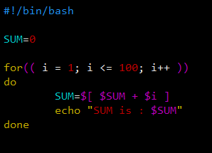
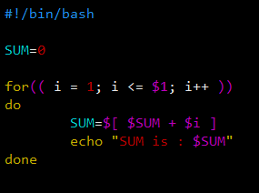
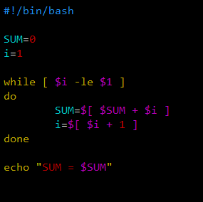

[toc]

# 流程控制

## if 语句

### 基本语法

~~~java
if [ condition ]
then
	// command...
fi

// 写做一行
if [ condition ] ; then command... ; fi
~~~

~~~java
if [ condition ]
then
	// command...
elif
then 
	// command...
else
	// command...
fi
~~~

#### 注：

fi 即 if 的倒写。

### 案例

> 编写程序，输入参数，>= 60，输出 “及格”；< 60，输出 “不及格”。

~~~java
#!/bin/bash

if (( $1 >= 60 ))
then
        echo "及格了"
else
        echo "不及格"
fi
~~~

~~~
[root@localhost shcode]# sh score.sh 61
及格了
~~~

## case 语句

### 基本语法

~~~
case valuse in
model 1)
	command...
	;;
model 2)
	command...
	;;
*)
	command...
	;;
esac
~~~

### 注：

每个 case 分支用右圆括号开始，用两个分号 ;; 表示 break。即执行结束，跳出整个 case。

esac 语句：esac（就是 case 反过来）作为结束标记。

### 案例

> 当命令行参数为 1 时，输出 “周一”；参数为 2，输出 “周二”；其他情况输出 “other”。

~~~
#!bin/bash

case $1 in
"1")
        echo "Monday"
        ;;
"2")
        echo "Tuesday"
        ;;
*)
        echo "other"
        ;;
esac

~~~

~~~
[root@localhost shcode]# sh casedemo.sh 1
Monday
[root@localhost shcode]# sh casedemo.sh 2
Tuesday
[root@localhost shcode]# sh casedemo.sh 3
other
~~~

## for 循环

### 基本语法

~~~
// 写法一
for x in v1 v2 ... vn
do
	command...
done
~~~

~~~
// 写法二
for(( 初始值; 循环控制条件; 变量变化 ))
do 
	command...
done
~~~

### 案例

> [打印命令行输入的参数（这里可以看出 $* 和 $@ 的区别）](4-位置参数变量.md/####$* 与 $@ 的比较)


> 从 1 加到 100 的值输出显示。



> 从 1 加到 n 的值输出显示。



## while 循环

### 基本语法

```
// 写法一
while [ codition ]
do 
	command...
done
```

~~~
// 写法二
while(( $int<=5 ))
do
    echo $int
    let "int++"
done
~~~

### 案例

> 从 1 加到 n 的值输出显示。



