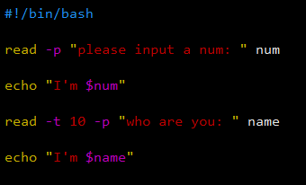
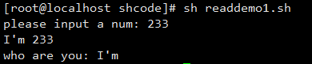

[toc]

# read

## read：读取控制台输入

### 基本语法

```
read (选项) [参数]
```

| 选项 | 说明                      |
| ---- | ------------------------- |
| -p   | 指定读取值时的提示符      |
| -t   | 指定读取值时的等到时间(s) |

| 参数 | 说明               |
| ---- | ------------------ |
| 变量 | 指定读取值的变量名 |

### 案例

> 读取控制台输入一个 num 值。
>
> 在 10 秒内，读取控制台输入一个 num 值。



