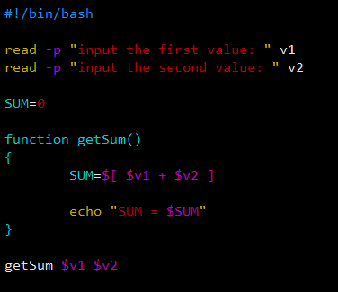
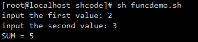

[toc]

# 函数

> Shell 编程与其他编程语言一样，有系统函数，也能自定义函数。。。

## 系统函数

### basename

> 返回完整路径最后 / 的部分，常用于获取文件名。

```
basename [pathname] [suffix]
basename [string] [suffix]

// basename 命令会删除掉所有前缀包括最后一个('/')的字符，然后将字符串显示。即显示文件名。。
```

| 选项   | 说明                                                         |
| ------ | ------------------------------------------------------------ |
| suffix | 如果 suffix 被指定了，basename 会将 pathname / string 中的 suffix 去掉。 |

#### 案例

> 返回 /root/shcode/a.txt。

### dirname

> 返回完整路径最后 / 前面的部分，常用于获取返回路径。

```
dirname 绝对路径

// 从给定的包含绝对路径的文件名中去除掉文件名，返回剩下的路径。
```

#### 案例

> 返回 /root/shcode/a.txt。

## 自定义函数

### 基本语法

```
[ function ] funname [()]
{
    action;

    [return int;]
}
```

### 调用

```
funname [value]
```

### 案例

> 计算输入两个参数的和（控制台输入） -- getSum




