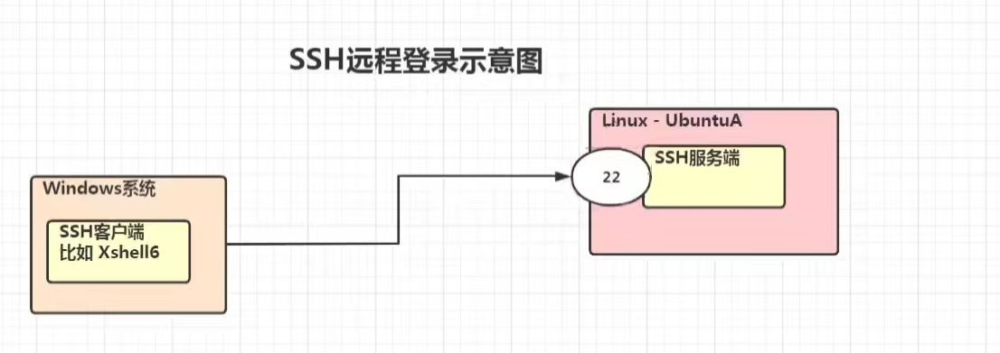

[toc]

# SSH

## 概述

> SSH(Secure Shell)：由 IEIF 的网络工作小组(Network Working Group)所制定。SSH 为建立在应用层和传输层基础上的安全协议。
>
> SSH 是目前较可靠，专为远程登录会话和其他网络服务提供安全性的协议。常用于远程登录。几乎所有的 UNIX / Linux 平台都可以运行 SSH。
>
> 使用 SSH 服务，需要安装相应的服务器和客户端。客户端和服务器的关系：
> 	如果 机器A 需要被 机器B 所远程控制，那么 机器A 需要安装 SSH 服务器，机器B 需要安装 SSH 客户端。
>
> 与 CentOS 不一样，Ubuntu 默认没有安装 SSHD 服务(使用 netstat 指令查看：apt install net-tools)。因此，我们无法远程登录。

## 安装

### 安装 SSH 和启用

​	执行以下指令，即在当前系统上安装了 SSH 服务端和客户端。

```
sudo apt-get install openssh-server
```

### 重启 sshd 服务

​	执行以下指令，即开启了 sshd 服务，开始监听 22号端口。

```
service sshd restart
```

### 查看是否启动

```
netstat -anp | more
```



## 从一台 Linux 远程登陆另一台 Linux

> 在创建服务器集群时，会使用到以下技术。

```
ssh 用户名@IP

// 如：ssh nishi@192.168.200.133
```

使用 ssh 访问，如访问出现错误。可查看是否有以下文件。

/.ssh/known_ssh 尝试删除该文件以解决。

### 退出

```
exit / logout
```

